<h3><code>ali@github ~ $ ./contributions.sh</code></h3>

  

<h3><code>ali@github ~ $ ./boot.sh && neofetch</code></h3>

<table>
<tr>
<td valign="top"></td>
<td valign="top"></td>
</tr>
</table>

 

`$` **currently shipping** — agentic AI systems, RAG assistants, AI chatbots, n8n/CRM automation, and SaaS MVPs for real businesses, mostly through **Agenryx Labs**.

`$` **open to** — freelance & agency collaboration on agentic AI, RAG, chatbots, n8n/Make automation, and backend/SaaS builds.

`$` **ask me about** — agent workflows, RAG & vector search, n8n automation, CRM/lead pipelines, FastAPI backends.

 

the heatmap above pulls real contribution data every day — no API token, no third-party stats service, no stale cache.

